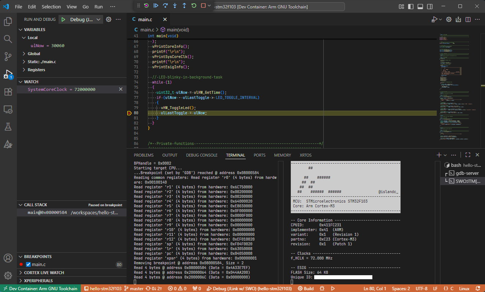

# hello-stm32f103 [](LICENSE)

A simple "Hello World"-like project for the STMicroelectronics STM32F103 MCU.

<p align="center"></p>

This project contains a simple set of modules to get the MCU running in a minimal configuration:
  - LED blinky on pin `PC13`
  - Debug output via SWO

## Requirements

* Hardware
  * "[Blue Pill](https://stm32-base.org/boards/STM32F103C8T6-Blue-Pill.html)" STM32F103 development board or similar
  * *SEGGER J-Link* or *ST-Link* debug probe (see also: [islandcontroller/jtag-wire-adapter](https://github.com/islandcontroller/jtag-wire-adapter))
* Software
  * Linux OS or WSL installation
  * [Docker Engine](https://docs.docker.com/engine/install/debian/) (running within WSL if applicable)
  * VSCode [Dev Containers](https://marketplace.visualstudio.com/items?itemName=ms-vscode-remote.remote-containers) extension
  * (WSL only) [usbipd-win](https://learn.microsoft.com/en-us/windows/wsl/connect-usb)

## Usage

* Clone this repository using the following command. Note the use of the `--recursive` tag.
  ```
  git clone --recursive https://github.com/islandcontroller/hello-stm32f103
  ```
* Open the folder in VSCode
* Connect debug probe
  * (WSL only) attach to WSL using `usbipd attach --wsl --busid <...>`. **This needs to be completed before starting the Dev Container.**
* Run the command "**Dev Containers: Reopen in Container**"
  * Check if the debug probe is recognised as a connected USB device by running `lsusb`.
  * On first launch, you may need to install some udev rules on your host machine. Copy the files to your workspace by running `setup-devcontainer` inside the container.
  * Re-open the workspace on your host and run the `install-rules` script inside the `.vscode/setup` folder.

        cd .vscode/setup
        sudo ./install-rules

  * Afterwards, restart the devcontainer.
* If prompted, select the "`Arm GNU Toolchain x.x`" CMake Kit. 
* Run "**CMake: Configure**"
* Build using "**CMake: Build [F7]**"
* Start debugging using "**Debug: Start Debugging [F5]**"
* Continue execution once the breakpoint in `main()` is reached.
* Open the `SWO:ITM[port:0]` console in the *Terminal* tab to display the debug output.

## Licensing

If not stated otherwise in the specific file, the contents of this project are licensed under the MIT License. The full license text is provided in the [`LICENSE`](LICENSE) file.

    SPDX-License-Identifier: MIT
